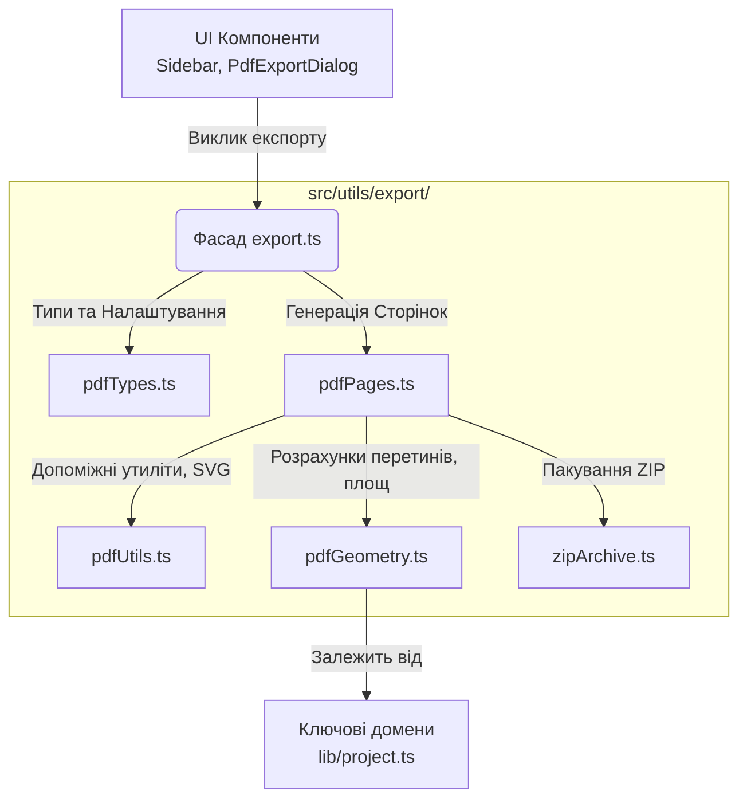

# SlabCutPlanner v2 - Architecture & Quick Start Guide

Цей файл створено для швидкого онбордингу розробників та AI-асистентів. Він описує архітектуру, логіку роботи та структуру папок проекту SlabCutPlanner, щоб уникнути необхідності повного перечитування кодової бази при кожному старті.

## 🎯 Про проект (Overview)
SlabCutPlanner — це просунутий інструмент для 2D-розкрою та 3D-візуалізації деталей з натурального каменю та керамограніту.
Ключовий функціонал включає: 
- Задання параметрів слябів (розмір, фото текстури, дефекти).
- Створення деталей різної форми (з вирізами, фасками, підворотами).
- Автоматичне та ручне пакування (розміщення) деталей на слябі з урахуванням відступів та дефектів.
- Перенесення текстури зі сляба на деталі (Texture matching).
- 3D-збірка готового виробу (стільниці) в реальному часі.

## 🛠 Технологічний стек
- **Core:** React 19 + TypeScript + Vite
- **State Management:** Zustand (`zustand`)
- **2D Canvas:** Konva.js (`react-konva`)
- **3D Viewer:** Three.js (`@react-three/fiber`, `@react-three/drei`)
- **Styling:** TailwindCSS v4
- **Math/Geometry:** Власні алгоритми перетину полігонів (point-in-polygon, ray-casting).

## 📂 Структура проекту (`src/`)

### 1. `domain/` (Моделі даних)
- `types.ts` — єдине джерело істини. Містить інтерфейси `Project`, `SlabInstance`, `Detail` (логічна деталь), `DetailPart` (фізичний шматок після декомпозиції), `Placement` (координати на слябі), `TextureLayout`.
- `defaults.ts` — генератори UID та дефолтні значення.

### 2. `store/` (Глобальний стан)
- `useProjectStore.ts` — ядро програми (розбито на 5 незалежних слайсів: `EditorUISlice`, `TextureSlice`, `HistorySlice`, `PackingSlice`, `ProjectSlice`). Використовує `immer` для зручних та безпечних оновлень стану.
- Синхронізація локального стану відбувається через `IndexedDB` (`idb-keyval`), що усуває ліміт у 5 MB.
- `useStore.ts` (`useUIStore`) — відповідає виключно за UI-стан (наприклад, перемикання між екранами `2d` / `3d`).

### 3. `engines/` (Математика та алгоритми)
- `geometry.ts` — відповідає за розбиття (explode) складних логічних `Detail` (наприклад, стільниці з підворотом) на плоскі `DetailPart` для розкрою. Використовує factory closure pattern для ізоляції стейту.
- `packing.ts` — двигун пакування (Bin Packing). Визначає, чи поміститься деталь на сляб, уникаючи перетинів з іншими деталями, відступів та дефектів. Тяжкі розрахунки (`autoPack`) працюють ізольовано у фоновому `Web Worker`.

### 4. `components/2d/` (Двовимірний розкрій)
- `SlabBoard.tsx` — гігантський компонент, який рендерить Konva-полотно. Обробляє складні взаємодії: Drag & Drop деталей, прилипання (snapping), ручні розміри (`ManualDimensions`), обертання та позиціонування камери.

### 5. `components/3d/` (Тривимірний перегляд)
- `Viewer3D.tsx` — використовує R3F для екструзії 2D-полігонів у 3D-меші. Тут також розраховуються UV-мапи, щоб текстура сляба ідеально лягала на готовий 3D-виріб (включаючи торці).

### 6. `components/ui/` (Інтерфейс)
- Звичайні React-компоненти (панелі керування, модальні вікна, Sidebar), стилізовані через TailwindCSS.

## 🔄 Життєвий цикл (Data Flow)
1. Користувач додає деталь (через UI). Викликається `useProjectStore.addDetail`.
2. Стор викликає `geometry.ts -> explodeDetails`, щоб розрахувати точки полігонів для цієї деталі.
3. Далі викликається `packing.ts -> recalc`, який намагається знайти вільне місце на активному слябі.
4. Оновлений `Project` зберігається в стан та `localStorage`.
5. `SlabBoard.tsx` автоматично перемальовує сцену Konva, базуючись на масиві `project.placements`.
6. При перемиканні в 3D, `Viewer3D` читає `project.placements` та `project.textureLayouts`, щоб зібрати виріб.

## 🚀 Quick Start для AI/Розробника
Якщо ти продовжуєш роботу над проектом, ось де шукати логіку залежно від задачі:
- **Баг при перетягуванні деталі?** -> `src/components/2d/SlabBoard.tsx`
- **Деталь накладається на дефект?** -> `src/engines/packing.ts` (`validatePlacement`)
- **Неправильно розраховується форма стільниці?** -> `src/engines/geometry.ts`
- **Потрібно додати нове поле для сляба?** -> Онови `types.ts`, потім `useProjectStore.ts`, і нарешті UI в `Sidebar`.
- **Проблеми з текстурою в 3D?** -> `src/components/3d/Viewer3D.tsx`

## 🖨 Експорт PDF (Архітектура)
Модуль генерації PDF (`src/utils/export`) декомпозовано за принципом **Facade Pattern**, щоб забезпечити стабільність зовнішнього API:

- **`export.ts`**: Лише orchestration (оркестрація). Експортує `exportProjectPdf` та `exportProjectPng`.
- **`pdfPages.ts`**: Генерує SVG рядки для кожної сторінки (Overview, Details, Slabs, 3D).
- **`pdfGeometry.ts`**: Вся "важка" математика відв'язана від рендеру сторінок.
- **`pdfUtils.ts`**: Робота з текстом, одиницями виміру, конвертація SVG -> PNG.
